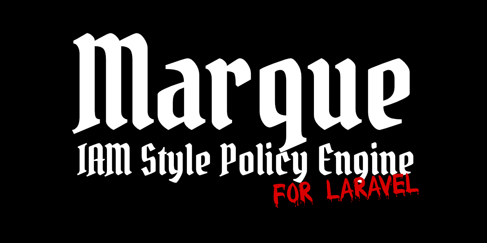

<p align="center">
  
</p>

[](https://github.com/dynamik-dev/marque/actions/workflows/lint.yml)
[](https://github.com/dynamik-dev/marque/actions/workflows/static.yml)
[](https://github.com/dynamik-dev/marque/actions/workflows/tests.yml)
[](https://phpstan.org/)

A [letter of marque](https://en.wikipedia.org/wiki/Letter_of_marque) was a government-issued document granting scoped permission to operate in specific waters. This package does the same thing for Laravel. A user can be an admin in one team and a viewer in another. Deny rules, permission boundaries, and JSON policy documents are built in. The whole thing plugs into Laravel's Gate.

```bash
composer require dynamik-dev/marque
```

---

## Quick look

```php
$user->assignRole('admin', scope: $acmeTeam);
$user->assignRole('viewer', scope: $widgetTeam);

$user->can('members.remove', $acmeTeam);  // true
$user->can('members.remove', $widgetTeam); // false
```

Roles, boundaries, and deny rules can live in JSON files you import at deploy time:

```json
{
  "roles": [
    {
      "id": "editor",
      "permissions": ["posts.*", "comments.create", "!posts.delete"]
    }
  ],
  "boundaries": [
    { "scope": "plan::free", "max_permissions": ["posts.read", "comments.read"] },
    { "scope": "plan::pro", "max_permissions": ["posts.*", "comments.*", "analytics.*"] }
  ]
}
```

```bash
php artisan marque:import policies/production.json
```

---

## Features

### Wired into the Gate

`$user->can()`, `@can`, `$this->authorize()`, and `can:` middleware all work without any extra wiring.

```php
$user->assignRole('editor', $acmeOrg);

$user->can('posts.create', $acmeOrg); // true

Route::middleware('can:posts.create')->post('/posts', [PostController::class, 'store']);
```

```blade
@can('posts.create', $team)
    <button>New Post</button>
@endcan
```

### Deny rules

Prefix any permission with `!`. The denial overrides every other role that grants it.

```php
Marque::role('editor', 'Editor')
    ->grant(['posts.*', 'comments.*'])
    ->deny(['posts.delete']);

$editor->can('posts.create');  // true
$editor->can('posts.delete');  // false -- deny wins
```

### Permission boundaries

Boundaries set a ceiling on what any role can do inside a scope. A user with `admin` in a free-tier org still can't access pro-tier features.

```php
Marque::boundary('plan::free', ['posts.read', 'comments.read']);
Marque::boundary('plan::pro', ['posts.*', 'comments.*', 'analytics.*']);

$user->assignRole('admin', $freeOrg);
$user->can('analytics.view', $freeOrg);  // false -- boundary blocks it
$user->can('analytics.view', $proOrg);   // true
```

### Wildcards

```php
'posts.*'           // all post actions
'*.read'            // read anything
'*.*'               // superadmin
'posts.update.own'  // fine-grained qualifiers
```

### Contract-driven

Every component implements a PHP interface. You can swap any implementation through the service container. See [Swapping implementations](docs/extending/swapping-implementations.md).

---

## Why not Spatie?

[Spatie laravel-permission](https://github.com/spatie/laravel-permission) works well for flat RBAC. Marque adds scoped roles, deny rules, permission boundaries, and declarative policy documents. See the [full comparison](docs/comparison-with-spatie.md).

---

## Requirements

| Dependency     | Supported Versions |
| -------------- | ------------------ |
| PHP            | 8.4, 8.5           |
| Laravel        | 12, 13             |
| PostgreSQL     | 17+                |
| SQLite         | 3.35+              |
| Valkey / Redis | 8+                 |

SQLite works out of the box for development. PostgreSQL and Valkey are optional — the package tests against both in CI. MySQL is not officially supported but should work fine since Laravel's query builder abstracts the differences.

---

## Documentation

**Getting Started** &mdash; [Installation](docs/getting-started/installing-the-package.md) | [Seeding permissions and roles](docs/getting-started/seeding-permissions-and-roles.md)

**Authorization** &mdash; [Checking permissions](docs/authorization/checking-permissions.md) | [Roles](docs/authorization/working-with-roles.md) | [Scoped permissions](docs/authorization/scoping-permissions.md) | [Deny rules](docs/authorization/using-deny-rules.md) | [Boundaries](docs/authorization/setting-permission-boundaries.md)

**Integrations** &mdash; [Middleware](docs/integrations/restricting-routes-with-middleware.md) | [Blade](docs/integrations/checking-permissions-in-blade.md) | [Model policies](docs/integrations/integrating-with-model-policies.md) | [Sanctum](docs/integrations/scoping-sanctum-tokens.md)

**Policy Documents** &mdash; [Document format](docs/policy-documents/document-format.md) | [Import / Export](docs/policy-documents/importing-and-exporting.md)

**Extending** &mdash; [Swapping implementations](docs/extending/swapping-implementations.md) | [Events](docs/extending/listening-to-events.md) | [Cache](docs/extending/customizing-the-cache.md)

**Reference** &mdash; [Configuration](docs/reference/configuration.md) | [Contracts](docs/reference/contracts.md) | [Events](docs/reference/events.md) | [Artisan commands](docs/cli/artisan-commands.md) | [Comparison with Spatie](docs/comparison-with-spatie.md)
